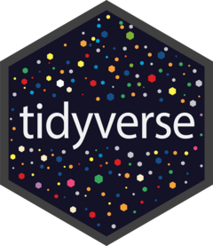

# Palash Gupta - B.Engineering (EE,EC,CS), MSc

Data Scientist (analysis/experimentation) building decision-support models and clear, visual analytics for real-world problems.

- Strengths: Experiment Design, Feature Engineering, Robust Validation, Model Building, and Stakeholder Translation.
- Domains: Finance, Healthcare, Business, Retail/Commercial Analytics, and Sports Analytics
- Main Languages: Python, R, SQL, Typescript, and React

## Contact

- Email: palashcscs@outlook.com
- LinkedIn: https://www.linkedin.com/in/pg-cscs
- GitHub: https://github.com/PGupta-Git

## Publications

- A Pragmatic, Parallel-Arm, Randomised Trial on the Effects of Two Repeated Sprint Training Protocols on Fitness Outcomes in Semi-Professional Male Soccer Players: Preliminary Report (preprint repo): https://github.com/PGupta-Git/Gupta_et_al_RST_Paper_Submission
- ORCID: https://orcid.org/0009-0000-0172-4009

## Toolbox

### Languages

### Development Tools

### IDEs

### Data Science

### Reporting & Apps

### Engineering

## Featured work

| Project | What it shows | Links |
|---|---|---|
| Player availability & decision support | KPI redesign, feature engineering, time-aware validation, decision framing | https://github.com/PGupta-Git/case-study-player-availability-decision-support        |
| Tactical / recruitment / performance analysis | Benchmarking, robustness checks, communication through visuals | https://github.com/PGupta-Git/case-study-tactical-recruitment-performance-analysis        |
| Drill Design App (production) | Product thinking, data modeling, shipping a real app | https://github.com/PGupta-Git/case-study-drill-design-app  https://www.drilldesignapp.com          |
| Repeated sprint training trial (research) | Statistical rigor, reproducible analysis artifacts | https://github.com/PGupta-Git/Gupta_et_al_RST_Paper_Submission        |
| Open-data experimentation lab | Public code: clean DS workflow, evaluation, visual storytelling | https://github.com/PGupta-Git/open-football-experimentation-lab         |

Note: case studies are anonymised (organisation names and private code/data are omitted).

## Selected impact

- Built non-linear models on high-frequency biometric telemetry to separate signal from noise and predict failure-mode risk (injury-risk proxy).
- Engineered new "availability" features with domain experts, replacing legacy KPIs with more predictive signals.
- Built forecasting models and automated reporting workflows, saving ~15 hours/week and reducing data retrieval latency by ~30%.
- Delivered executive dashboards for decision-making (market sentiment, product performance, performance monitoring).
- Led cross-functional delivery (Agile/Scrum) and bridged data engineering and non-technical stakeholders.

## How I work (analysis/experimentation)

- Start with a decision and a measurable target (KPI definition comes first).
- Establish baselines, define leakage-safe splits, and validate with time-aware backtesting when appropriate.
- Prefer simple, explainable models when they perform; add complexity only when it wins on validated metrics.
- Communicate uncertainty (calibration, intervals, sensitivity checks) and translate results into concrete actions.

