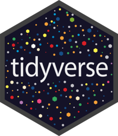

# Palash Gupta (B.Engg., MSc)

#### Senior Data Scientist & ML Engineer | Production ML & Decision Systems

I build production decision systems from problem framing, statistical modelling, and time-aware validation through cloud data architecture, MLOps, full-stack delivery, and stakeholder adoption. My work spans enterprise forecasting at IBM, predictive risk and survival analysis, high-frequency time-series modelling, public-sector ML platforms, and production SaaS.

**7+ years in Data and AI** · **Former IBM Squad Lead** · **Peer-reviewed author** · **Production SaaS shipped** · **Upstream open-source contributions**

**Focus:** Applied Machine Learning · Statistical Modelling · Production ML · MLOps · Cloud Data Architecture · Full-Stack AI Products · Technical Leadership

**Core languages:**
     

## Contact

- Email: <palashcscs@outlook.com>
- LinkedIn: [in/pgds](https://www.linkedin.com/in/pgds/)
- GitHub: [PGupta-Git](https://github.com/PGupta-Git)

## Selected impact

- **Architected petabyte-scale demand forecasting at IBM, driving 15% YoY revenue growth:** built distributed PySpark and SQL pipelines, reduced data-retrieval latency by 30%, and saved the finance team approximately 15 hours per week.
- **Designed predictive risk, survival, and forecasting models** using leakage-safe, time-aware validation to replace legacy measures with signals for high-value decisions ([Predictive Risk & Survival Analysis](https://github.com/PGupta-Git/case-study-predictive-risk-survival-analysis)).
- **Shipped a production SaaS with active paying subscribers:** [Drill Design App](https://www.drilldesignapp.com), built with Next.js, PostgreSQL (Neon), and Drizzle ORM ([Case Study](https://github.com/PGupta-Git/case-study-drill-design-app)).
- **Engineered a novel geometric metric from 25Hz optical tracking data** and built a dual-signal player-similarity framework analysing a full season of Premier League event data ([High-Frequency Time-Series Analysis Framework](https://github.com/PGupta-Git/case-study-high-frequency-time-series-analysis-framework)).
- **Published a peer-reviewed randomised controlled trial** applying ANCOVA and sensitivity analysis across six fitness outcomes ([Paper](https://doi.org/10.1080/24733938.2026.2684071) · [Data & Code](https://github.com/PGupta-Git/Gupta_et_al_RST_Paper_Submission)).
- **Led cross-functional delivery of decision-support dashboards** and analytical products for performance monitoring, market sentiment, recruitment, and opponent scouting ([Tactical & Recruitment Case Study](https://github.com/PGupta-Git/case-study-tactical-recruitment-performance-analysis)).

## Featured Work

| Project | Evidence of impact | Explore |
| --- | --- | --- |
| Drill Design App | Production SaaS with active paying subscribers, authentication, and PostgreSQL persistence | [Live product](https://www.drilldesignapp.com) · [Case study](https://github.com/PGupta-Git/case-study-drill-design-app) |
| Predictive Risk & Survival Analysis | Non-linear risk and survival modelling, leakage-safe temporal validation, and redesigned availability KPIs | [Case study](https://github.com/PGupta-Git/case-study-predictive-risk-survival-analysis) |
| High-Frequency Time-Series Analysis Framework | Novel metric from 25Hz tracking data; dual-signal player similarity across a full Premier League season | [Case study](https://github.com/PGupta-Git/case-study-high-frequency-time-series-analysis-framework) |
| Repeated-sprint training trial | Peer-reviewed parallel-arm RCT; reproducible ANCOVA and sensitivity analysis across six fitness outcomes | [Paper](https://doi.org/10.1080/24733938.2026.2684071) · [Data & Code](https://github.com/PGupta-Git/Gupta_et_al_RST_Paper_Submission) |
| Tactical, recruitment, and performance analysis | Transparent player benchmarking, uncertainty-aware robustness checks, and reusable dashboards and report templates for faster weekly analysis | [Case study](https://github.com/PGupta-Git/case-study-tactical-recruitment-performance-analysis) |
| Open-data experimentation lab | Public, reproducible data-science workflows covering evaluation and visual storytelling | [Repository](https://github.com/PGupta-Git/open-football-experimentation-lab) |

> Case studies are anonymised; organisation names and private code or data are intentionally omitted.

## How I Work: Decision Science, Engineering & Product

- **Define the Decision First:** Begin by identifying the business decision, user workflow, and measurable outcome. The target interaction dictates the modelling and system design.
- **Model and Validate with Rigour:** Establish robust baselines, define leakage-safe evaluation splits, and use time-aware backtesting to test whether a signal will generalise.
- **Build the Complete System:** Connect high-performance data pipelines and governed cloud services to production models and full-stack interfaces so users can act on the result.
- **Communicate Uncertainty and Drive Adoption:** Translate model outputs into explainable decisions, calibrate probabilities, handle edge cases, and refine the product through stakeholder feedback.

## Verified Open-Source Impact

Every contribution below links the reported problem, my contribution, and the verifiable upstream outcome.

- **[ageron/handson-mlp](https://github.com/ageron/handson-mlp) — community-endorsed Polars migration:** Migrated all notebook exercises across 19 chapters and appendices to Polars, maintaining the [`polars_integration`](https://github.com/PGupta-Git/handson-mlp/tree/polars_integration) branch. The upstream author endorsed the community fork in [Issue #23](https://github.com/ageron/handson-mlp/issues/23); [PR #41](https://github.com/ageron/handson-mlp/pull/41) is open to add the upstream README pointer.

- **[posit-dev/positron](https://github.com/posit-dev/positron) — two fixes merged with credited authorship:**
  - **Console button alignment:** Fixed native-button padding reported in [Issue #14155](https://github.com/posit-dev/positron/issues/14155). My [PR #14381](https://github.com/posit-dev/positron/pull/14381) was carried into merged upstream [PR #14445](https://github.com/posit-dev/positron/pull/14445).
  - **Help search keyboard navigation:** Added Enter and Shift+Enter match navigation for [Issue #12921](https://github.com/posit-dev/positron/issues/12921). My [PR #14380](https://github.com/posit-dev/positron/pull/14380) was carried into merged upstream [PR #14444](https://github.com/posit-dev/positron/pull/14444).

- **[can1357/oh-my-pi](https://github.com/can1357/oh-my-pi) — five defect diagnoses translated into upstream fixes:**
  - **OpenCode MCP discovery:** Diagnosed array-command coercion and ignored environment keys in [Issue #3180](https://github.com/can1357/oh-my-pi/issues/3180), authored [PR #3181](https://github.com/can1357/oh-my-pi/pull/3181), and received explicit credit when the equivalent fix merged in [PR #3182](https://github.com/can1357/oh-my-pi/pull/3182).
  - **Claude 4.6 provider routing:** Reproduced wire-ID and token-limit failures in [Issue #3067](https://github.com/can1357/oh-my-pi/issues/3067) and authored [PR #3068](https://github.com/can1357/oh-my-pi/pull/3068). The maintainer's merged fix [`47cc464`](https://github.com/can1357/oh-my-pi/commit/47cc46496209e06f89945f9b4515f22e621f71b6) credits the diagnosis and includes a dedicated regression test.
  - **Plan approval model retention:** Identified the incorrect model-index comparison in [Issue #3554](https://github.com/can1357/oh-my-pi/issues/3554); the exact proposed fix merged in [PR #3556](https://github.com/can1357/oh-my-pi/pull/3556).
  - **Linux desktop notifications:** Diagnosed BEL fallback failures on VTE terminals in [Issue #3685](https://github.com/can1357/oh-my-pi/issues/3685) and authored [PR #3686](https://github.com/can1357/oh-my-pi/pull/3686); the production D-Bus solution merged in [PR #3687](https://github.com/can1357/oh-my-pi/pull/3687).
  - **Temporary model thinking overrides:** Diagnosed the role-override failure in [Issue #5290](https://github.com/can1357/oh-my-pi/issues/5290) and authored [PR #5291](https://github.com/can1357/oh-my-pi/pull/5291); the equivalent resolver and regression coverage merged in [PR #5297](https://github.com/can1357/oh-my-pi/pull/5297).

- **[andrewRowlinson/mplsoccer](https://github.com/andrewRowlinson/mplsoccer) — merged visualisation feature & documentation fixes:**
  - **Speedometer and gauge charts:** Ported and integrated the [`znstrider/speedo`](https://github.com/znstrider/speedo) `Speedometer` class for [Issue #16](https://github.com/andrewRowlinson/mplsoccer/issues/16) in open [PR #118](https://github.com/andrewRowlinson/mplsoccer/pull/118).
  - **Curved radar labels and resilient documentation builds:** Fixed Wikipedia thumbnail rate-limiting to repair Read the Docs builds, which the maintainer merged with credited authorship in [PR #122](https://github.com/andrewRowlinson/mplsoccer/pull/122). Added vector-glyph curved labels, multi-line layout, and bottom-half auto-flipping for [Issue #35](https://github.com/andrewRowlinson/mplsoccer/issues/35) in merged [PR #120](https://github.com/andrewRowlinson/mplsoccer/pull/120).

- **[brilliantnz/flickernaut](https://github.com/brilliantnz/flickernaut) — merged stability fixes:** Prevented crashes from invalid desktop files and removed duplicate preference entries in merged [PR #9](https://github.com/brilliantnz/flickernaut/pull/9).

- **[oseymour/ScraperFC](https://github.com/oseymour/ScraperFC) — regression identified and released:** Reported missing FBref team and player identifiers in [Issue #72](https://github.com/oseymour/ScraperFC/issues/72); the maintainer verified the defect and released the requested fix in `v4.1.0`.

## Publication & Reproducible Research

- **Peer-reviewed research:** [A pragmatic, parallel-arm, randomised trial on the effects of two repeated-sprint training protocols on fitness outcomes in semi-professional male soccer players: preliminary report](https://doi.org/10.1080/24733938.2026.2684071), published in *Science and Medicine in Football* (2026) · [Data & Code Repository](https://github.com/PGupta-Git/Gupta_et_al_RST_Paper_Submission)
- ORCID: <https://orcid.org/0009-0000-0172-4009>

## Certifications

- **Google Cloud Certified Professional Data Engineer** · [verify on Credly](https://www.credly.com/badges/a12dadfa-529c-402e-a831-0326d337469d/public_url)
- **Stanford University: Machine Learning Specialization** · [verify on Coursera](https://coursera.org/share/aa5c2db17638c4d071fbc8688950bfe5)
- **Pearson: Learn MLOps for Machine Learning** · [verify on Coursera](https://coursera.org/share/68c04e35f5bb09d75d764a114d69f4f9)
- **IBM: Machine Learning with Python (V2)** · [verify on Credly](https://www.credly.com/badges/c4c2fe8d-601f-4bdb-b44c-a889786d7f85/public_url)
- **Google Analytics Certification** · [verify on Skillshop](https://skillshop.credential.net/d7784b7c-a1e2-4600-aee2-1e68299bf812#acc.I5fC8Mm0)

## Toolbox

### 💻 Core Languages, Runtimes & Dev Environments

    
      
    

### 🧠 Machine Learning, Statistics & MLOps

              
        

### 🤖 LLM & AI Engineering

     
     
         
  
    

### 📡 Distributed Compute, Cloud Storage & Data Orchestration

     
           

### 💾 Databases, ORMs & Local Dataframes

    
      

### 📊 Visualization, Web Apps & Reporting

        

     

### 🧪 Testing, Quality & Reproducibility

    
   
         
